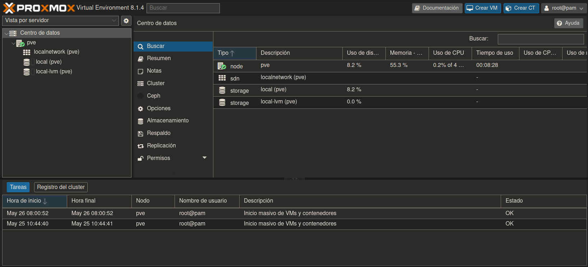

# Instalción
Priero descargamos el iso, para ello vamos a la web de Promox [https://www.proxmox.com/en/downloads](https://www.proxmox.com/en/downloads) y descargamos la última versión del iso.

Al insertar el CD-ROM o USB con Proxmox nos sale la pantalla de binvenida.

Bienbenida a Proxmox Virtual Environment

Aceptamos la licencia:

Escogemos el HDD donde instalar y damos click al botón `Option`:

Configuramos Las particiones:

Escogemos la localidad, zona horaria y teclado:

Ponemos la contraseña y email:

Configuramos la red:

Verificar que los datos llenados son los deseados. Y damos click en `Install`. Al terminar la instalación click en `Reboot`

Al reiniciar escogeremos la primera opcion del GRUB: `Proxmox VE GNU/Linux`\

Consola de Proxmox, en la misma pantalla aparecera la `URL` para administrar el Proxmox via web.\

# Interfaz Web de Proxmox

En un navegador firefox abrimos la URL [https://192.168.0.2:8006](https://192.168.0.2:8006).

Advertencia del certificado autofirmado, damos click en `Avanzado` y luego en `Aceptar el riesgo y continuar`.\

Ventana para autenticarnos a la Aministración web del Proxmox.\

Interfaz Web del Proxmox\

$\color{#50fa7b}{\textsf{FIN}}$