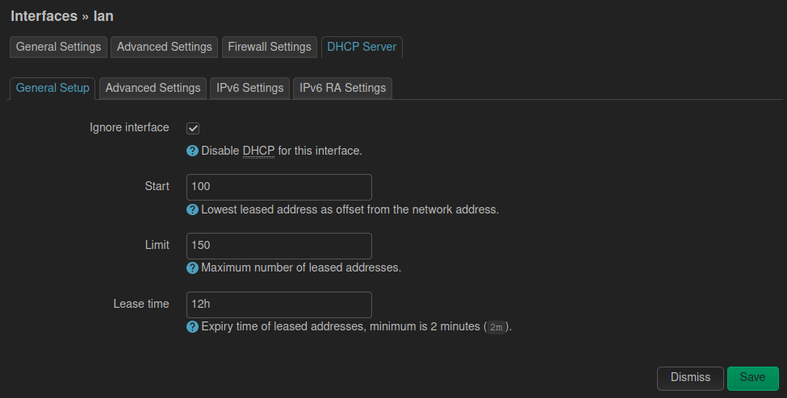

# Configuración inicial

En un navegador abrimos la URL de la administración web, por defecto [http://192.168.1.1](http://192.168.1.1), usuario `root` sin contraseña.

Una vez autenticado vamos a `System >> Administration >> Router Password` y configuramos la contraseña de administración.


Si tenemos un servidor DHCP, desabilitamos el DHCP en la interfaz LAN del router para ello vamos a `Networt >> Interface`.

En la interfaz LAN damos click en: `Edit >> DHCP Server >> General Setup`, y marcar

* [X] `Ignore interface`

Aplicamos la la configuración, mas abajo donde dice: `Save` y luego en `Save & Apply`.

 


# Configurar la interfaz WAN

Editamos la interfaz WAN en `Network >> Interfaces` damos click en `Edit` en la interfaz WAN.

* General Settings
  - Protocol: `Static address`
  - Presionamos el botón: `Switch protocol`
  - IPv4 address: `tu_ip_wan_router`
  - IPv4 gateway: `tu_ip_gateway_router`
  - IPv4 broadcast: `255.255.255.0`
  - Use custom DNS servers: `ip_dns`
  - Terminamos presionando el botón: `Save`

Aplicar la la configuración con el botón `Save` y luego en `Save and Apply`

 


# Configurar Proxy

Vamos a: `Syistem >> Software` click en el botón `Configure opkg...` y en el cuadro de texto `/etc/opkg.conf` agregamos al final la configuracion del proxy.

```bash
option ftp_proxy http://ip_proxy:port
option http_proxy http://ip_proxy:port
option https_proxy http://ip_proxy:port
```

Aplicar la la configuración con el botón `Save`

 


# Actualizar el repositorio e instalar software

Vamos a `System >> Software` click en el botón `Update list...` para actualizar los repositorios. 

Para instalar un software clickamos en el botón `Install` al lado del nombre del software.


# Instalar el idioma español a la interfaz web

Vamos a `Syistem / Software` en la caja de texto `filte` escribimos `luci-i18n-base-es`, una ves filtrado damos en el botón `Install`.

Luego por la web vamos a `System >> Language and Style` y seleccionamos en `Language: Español (Spanish)`.
