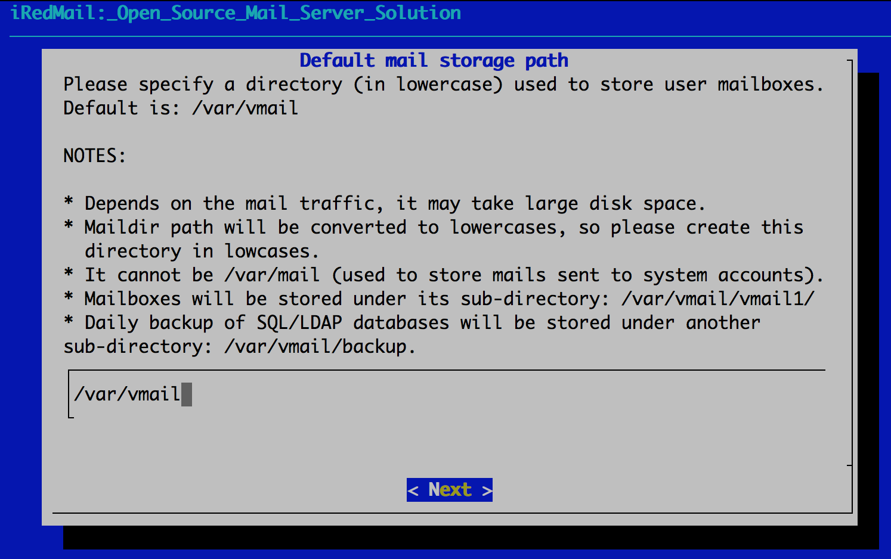
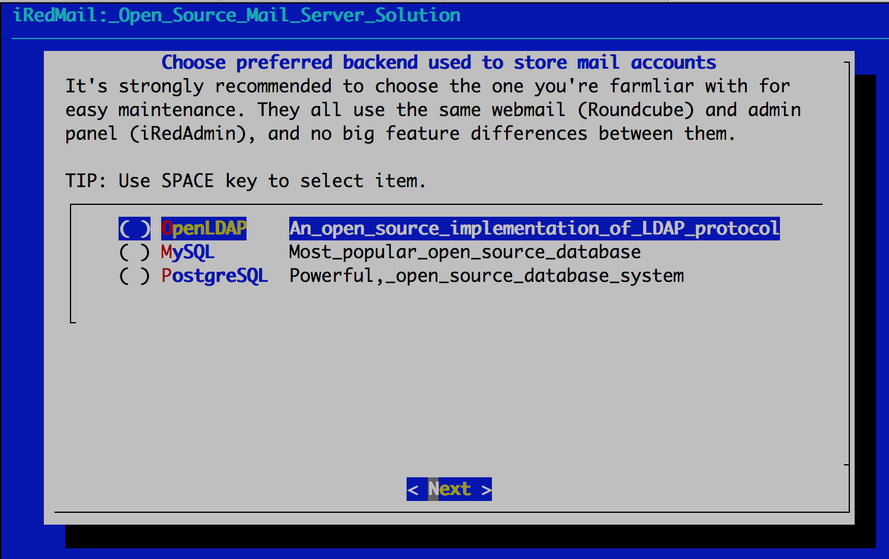
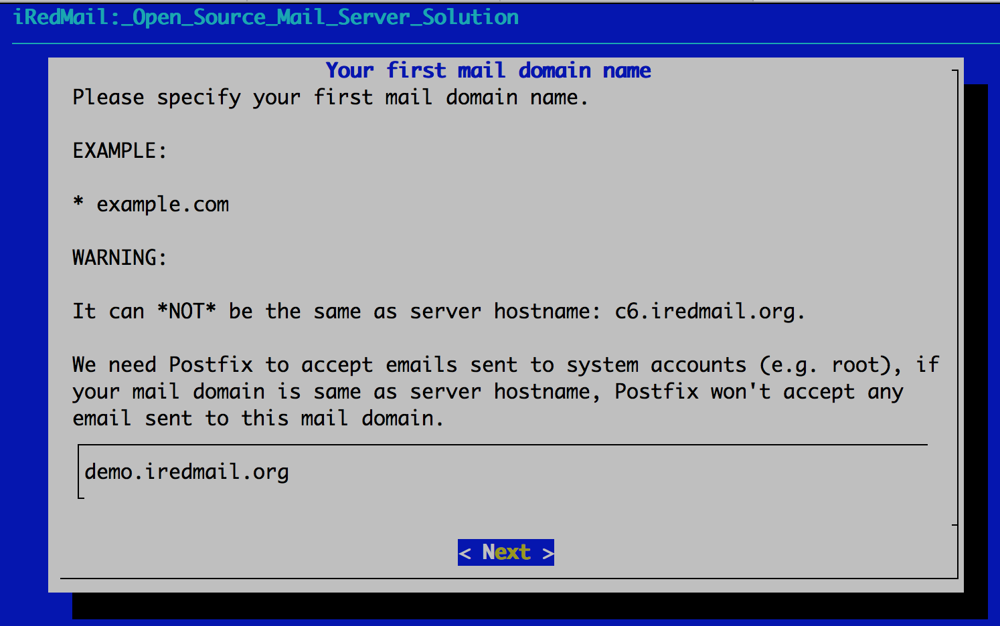
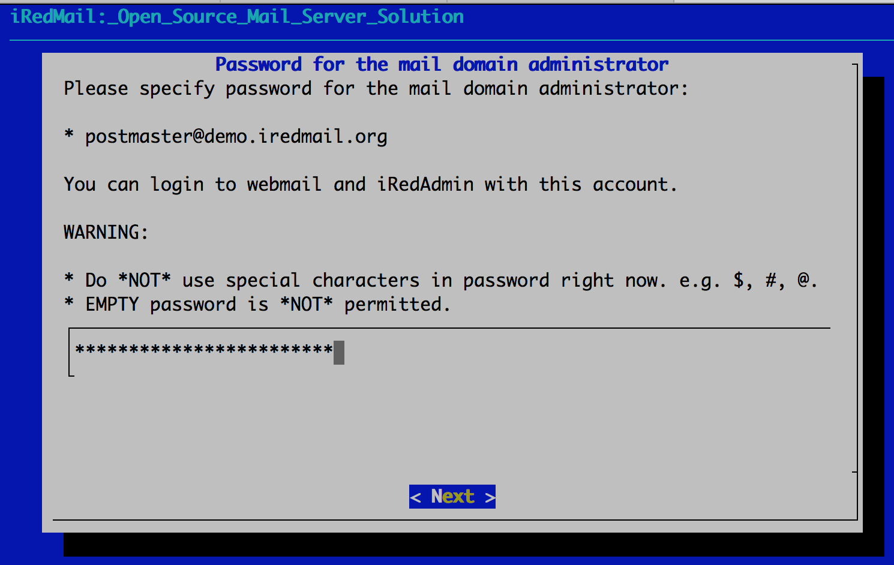
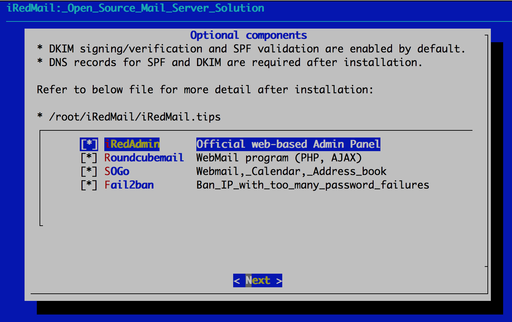
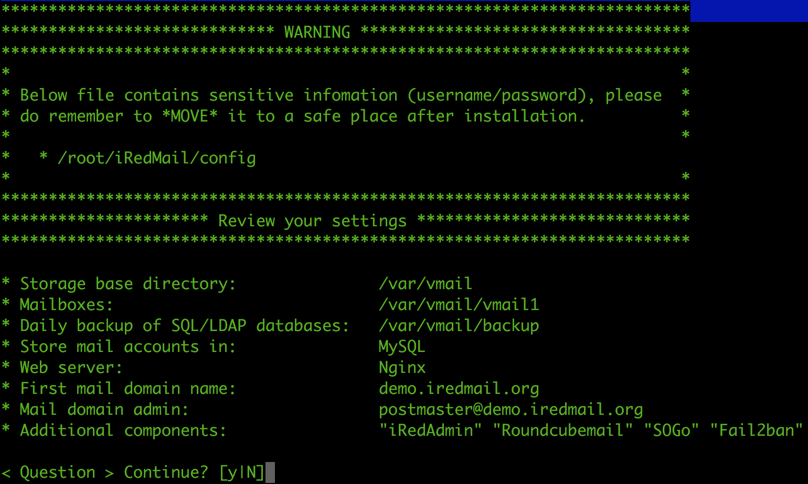

# iRedMail


>[!INFO]
>iRedMail es una solución de código abierto que te permite configurar y gestionar un servidor de correo electrónico completo. Es una herramienta muy útil si estás buscando una forma de configurar tu propio servidor de correo electrónico de manera sencilla y eficiente.


# Instalación en Debian 12
## Establezca un nombre de host y el dominio (FQDN)

Edite el archivo `hostname` y `hosts`

Archivo: `/etc/hostname`
```bash
mx
```

Archivo: `/etc/hosts`
```bash
127.0.0.1   mx.tudominio.cu mx localhost localhost.localdomain
# 192.168.0.1 mx.tudominio.cu mx localhost localhost.localdomain
```

Verifique el nombre de host FQDN. Si no se cambió después de actualizar los dos archivos anteriores, reinicie el servidor para que funcione.

Introduzca el comando hostname -f para ver el nombre de host actual:

```bash
$ hostname -f
mx.tudominio.cu
```


## Instale los paquetes requeridos

```bash
$ apt update && apt upgrade

$ apt install -y gzip dialog
```


## Descargue la última versión de iRedMail

Visite la web [https://iredmail.org/download.html](https://iredmail.org/download.html) y descargar la ultima version, en este momento la `1.6.8`, y descomprimir el tarball.

```bash
$ wget -cv https://github.com/iredmail/iRedMail/archive/refs/tags/1.6.8.tar.gz

$ tar zxf 1.6.8.tar.gz
```

# Inicie el instalador de iRedMail

Ahora está listo para iniciar el instalador de iRedMail, le pedirá varias preguntas sencillas.

```bash
$ cd iRedMail-1.6.8

$ bash iRedMail.sh
```

## Capturas de pantalla de instalación:

Bienvenido y gracias por su uso.


Especifique la ubicación para almacenar todos los buzones. El valor predeterminado es /var/vmail/.



Elija el backend utilizado para almacenar cuentas de correo, en este caso `MySQL`.



Añade tu primer nombre de dominio de correo (tudominio.cu)



Establezca la contraseña de la cuenta de administrador de su primer dominio de correo.

>[!NOTE]
>Esta cuenta es una cuenta de administrador y un usuario de correo. Eso significa que puedes inicie sesión en el correo web y el panel de administración (iRedAdmin) con esta cuenta, inicie sesión como nombre de usuario es la dirección de correo electrónico completa. 



Elija componentes opcionales (iRedAdmin, Roundcubemail)



Después de responder las preguntas anteriores, el instalador de iRedMail le pedirá que revise y confirme para iniciar la instalación. Instalará y configurará los paquetes necesarios. automáticamente. Escriba `y` o `Y` y presione Enter para comenzar. 




# Cosas importantes que debe saber después de la instalación

Lea el archivo `iRedMail.tips` contiene:

* URL, nombres de usuario y contraseñas de aplicaciones basadas en web
* Ubicación de los archivos de configuración de software relacionados con el servicio de correo.
* Alguna otra información importante y sensible.


# Acceder al correo web y otras aplicaciones web

Una vez completada con éxito la instalación, podrá acceder a los programas basados ​​en web. Reemplazar `tu_server` por el nombre de host o la dirección IP de su servidor real.

* Correo web de Roundcube : `https://your_server/mail`
* Panel de administración web (iRedAdmin) : `https://your_server/iredadmin`


# Otras configuraciones
## Configurar Roundcube

Por defecto cuando el usuario se autentica en Roundcube, tiene que poner `usuario@tudominio.cu`, para poner solo `usuario` modifica el siguiente archivo.

Archivo: `/opt/www/roundcubemail/config/config.inc.php`

```bash
[...]
$config['username_domain'] = 'tudominio.cu';
[...]
```

## Configurar el Relayhost

Editamos el archivo `main.cf`

Archivo: `/etc/postfix/main.cf`

```bash
# IP o nombre FQDN
#relayhost = realy.tudominio.cu:port
relayhost = relay.midominio.com:26
```
## Copia de los correos entrante y saliente

Antes debemos crear la cuenta `copy` por la web `https://your_server/iredadmin`

Archivo: `/etc/postfix/main.cf`

```bash
[...]
sender_bcc_maps =
    hash:/etc/postfix/bcc_mail

[...]

recipient_bcc_maps =
    hash:/etc/postfix/bcc_mail
[...]
```

**Reiniciamos**

```bash
$ systemctl restart postfix
```

Creamos el archivo `bcc_mail` y lo mapeamos

```bash
$ echo "@tudominio.cu copy@tudominio.cu" > bcc_mail
$ postmap /etc/postfix/bcc_mail
```

# Rotación de los log

Por defecto solo se guardan 4 log por mes, para cambiar esto haga lo siguiente.

```bash
$ cp /etc/logrotate.d/rsyslog /etc/logrotate.d/mail
```

Editamos: `/etc/logrotate.d/rsyslog`

Comentamos lo siguiente:

```bash 
[...]
#/var/log/mail.log
[...]
```

Editamos: `/etc/logrotate.d/mail`

```bash
/var/log/mail.log
{
        rotate 53
        weekly
        missingok
        notifempty
        compress
        delaycompress
        sharedscripts
        postrotate
                /usr/lib/rsyslog/rsyslog-rotate
        endscript
}
```

Reiniciamos el servicio logrotate

```bash
$ systemctl restart logrotate        
```

## Actulizaciones de Clamav solo para cuba

Las base de virus de clamav estan bloqueada para cuba. por lo que lo descargaremos de otro sitio usando un script.

```bash
$ git clone https://github.com/roilanbr/up-clamav.git
$ bash up-clamav/install.sh
```

Agregue una tarea a `crontab`

Archivo: `/etc/crontab`

```bash
* 00    * * *   root    bash /opt/scripts/up-clamav.sh
```

Reiniciamos el servicio `cron`

```bash
$ systemctl restart cron.service
```